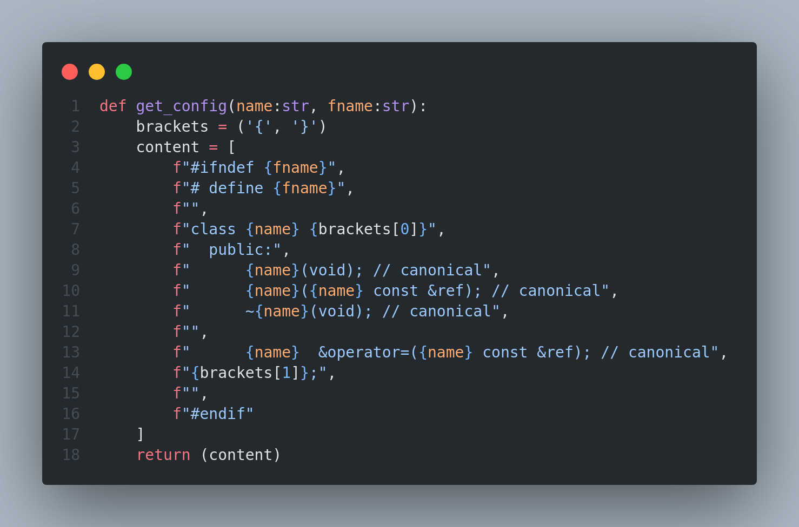

Hi! Welcome on Cpp_canonical. This program generate .hpp file at the Coplien canonical form.

> [!IMPORTANT]
> To be able to run the program, you will have to install `python` on your system if it is not already installed

## Install

To install Cpp_canonical you need to clone the repository in your 'home' directory.

```bash
cd && git clone https://github.com/0Slaye/cpp_canonical.git
```
Next you can add Cpp_canonical as an alias in your '.bashrc' or any 'rc' file (the file to execute is main.py).

> [!NOTE]
> Don't forget to source your 'bashrc' or any 'rc' file in wich you added the alias

## How to use

To correctly use Cpp_canonical you will need to give only one argument wich is the class name.

```bash
[Cpp_canonical_alias] [CLASS_NAME]
```

## Configuration

You can configure how your file will be create with the "config.py" file.
This is simple python, you only need to change what's inside each arrays ("header", "content", "footer").

